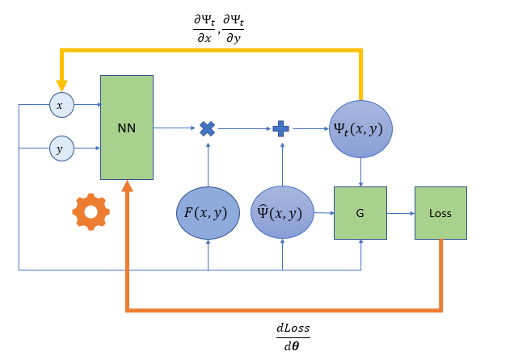

# INF 8225 Project

## Introduction
In this project, we try to solve some ordinary as well as partial differential equations with neural networks and compare 
the solutions with traditional solvers such as finite difference methods for elliptic equations and finite volume methods 
for hyperbolic ones. 

We tried to reproduce some results presented in the papers 
[Artificial Neural Networks for solving Ordinary and Partial Differential Equations](https://arxiv.org/abs/physics/9705023)

## Getting Started

For each implemented solver you will find a python script called **simulation.py** where you can define the differential equation 
you want to solve as well as the corresponding initial and/or boundary conditions
